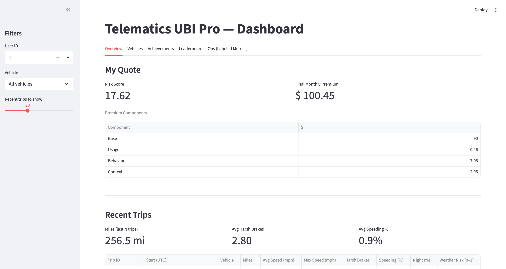
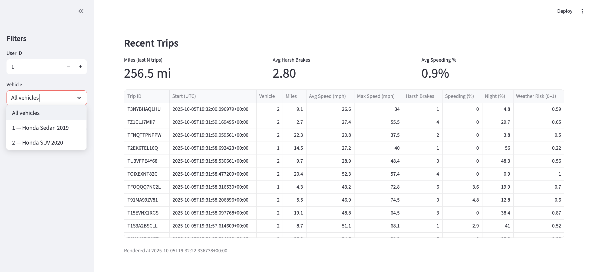
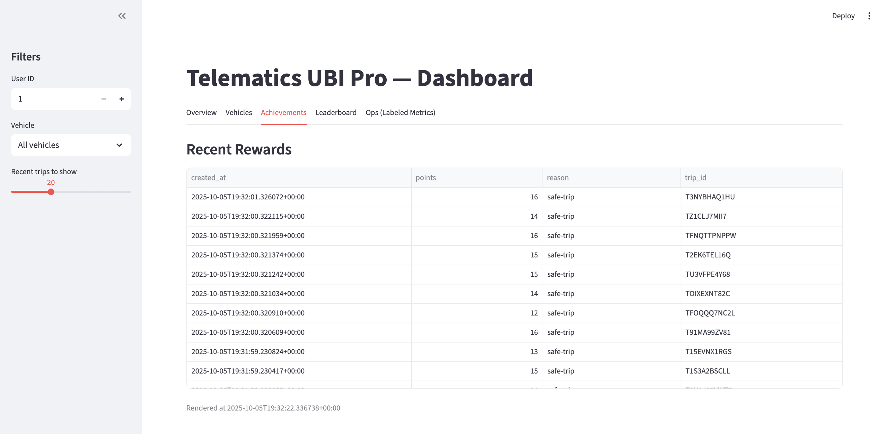
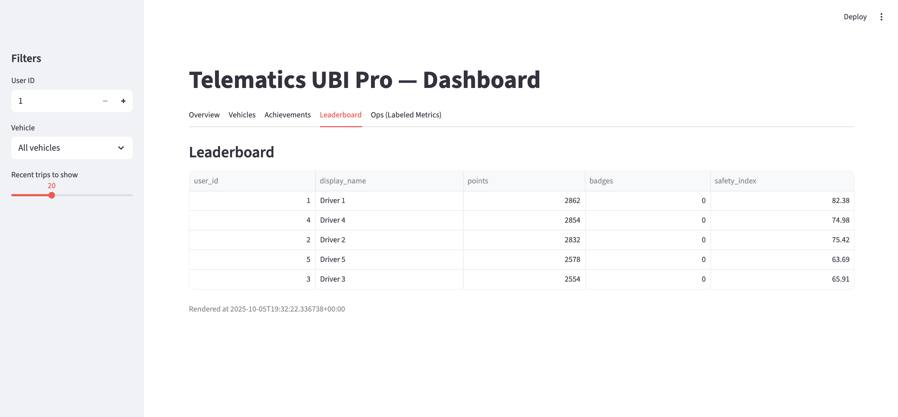
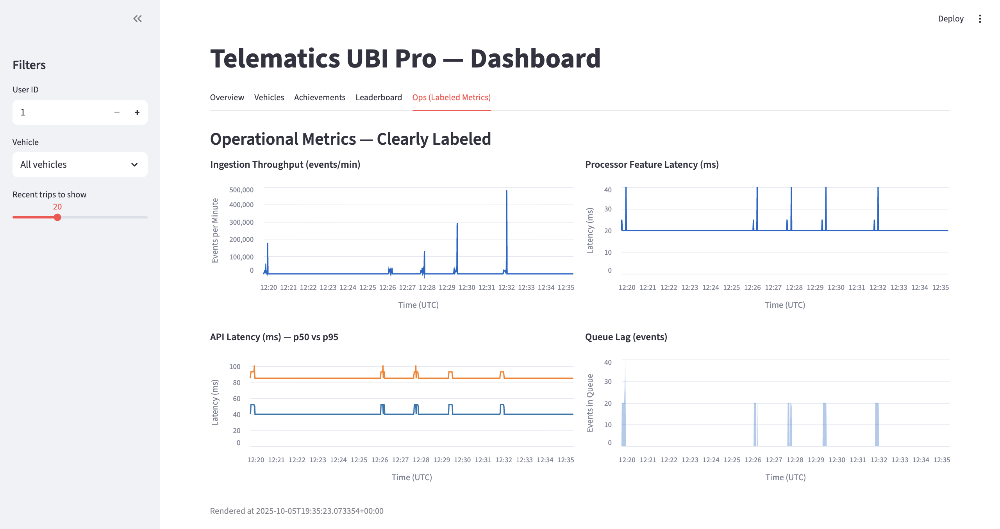
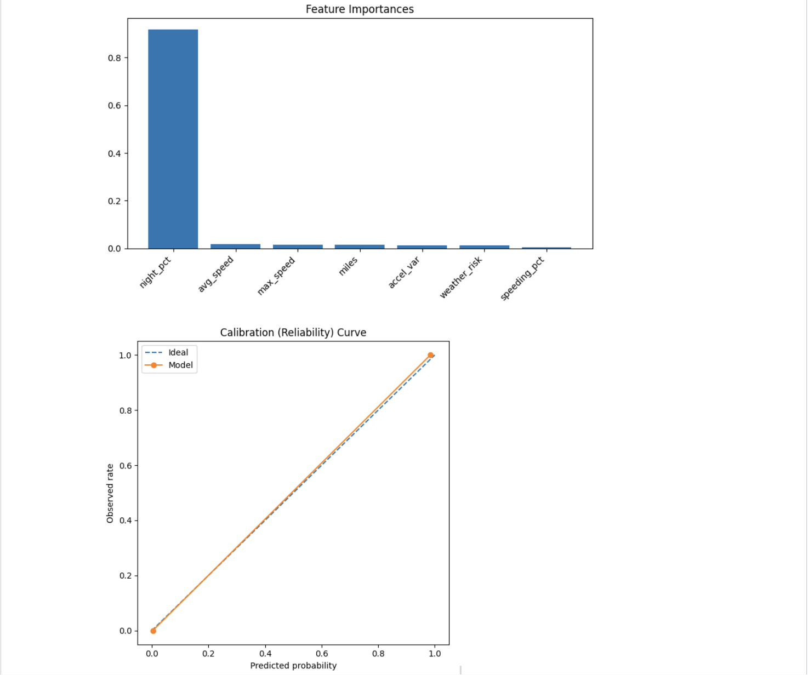

# Telematics UBI Pro — Usage‑Based Insurance

A compact, production‑shaped UBI system that runs in **1 click** and demonstrates end‑to‑end telematics: **multi‑vehicle** simulation, near‑real‑time feature engineering, **risk scoring**, **dynamic pricing** (PAYD + PHYD + context), **gamification**, a transparent **driver dashboard**, and **Recent Trips** on the Overview tab.  
This README also explains **how it meets every evaluation criterion** and provides **1‑click run** steps.

---

## ⚡ One‑Click Run (Dev) & Quick Demo

### Option A — One‑click Run (PyCharm or CLI)
**Step 1.** Open the project folder in PyCharm (Python **3.10+**, 3.11 recommended).  
**Step 2.** Run `dev.py` (Right‑click → *Run 'dev'*)  
_or via terminal:_
```bash
python dev.py
```

What happens automatically:
- Installs/validates dependencies from `requirements.txt`
- Initializes SQLite schema and seeds demo data (`data/ubi.db`)
- Launches **API**, **Processor**, **Simulator** (multi‑vehicle), and **Dashboard**
- **Auto‑free‑ports**: if 8000/8501 are busy, it picks free ports and prints the URLs

Open in your browser:
- **Dashboard** → `http://localhost:<DASH_PORT>` Example: http://localhost:53959


### Option B — Quick Dashboard‑Only Preview
```bash
python -m streamlit run src/dashboard/app.py
```
The dashboard reads the same local SQLite DB if present.

> For a single‑command container run later, add a `docker-compose.yml`. The app is stateless and ready.

---

## 🎯 Objectives → How this project delivers

1) **Improve premium accuracy using real‑world driving data**  
   - Trip features: `miles, avg_speed, max_speed, harsh_brakes, accel_var, night_pct, speeding_pct, weather_risk`.  
   - Per‑trip risk rolled into a **driver/vehicle risk score (0–100)**.  
   - Pricing = **vehicle base rate** + **usage (PAYD)** + **behavior (PHYD)** + **context** (`weather_risk`).  
   - Quotes persisted to `quotes` for auditability & analytics.

2) **Encourage safer driving behavior through usage‑based incentives**  
   - **Rewards engine**: points for safe trips, badges, and **leaderboard**.  
   - Safer habits reduce the behavioral premium component.

3) **Enhance transparency and engagement**  
   - **Overview**: Risk Score, Final Premium, clear **component breakdown**, and **Recent Trips** (+ summary metrics).  
   - **Vehicles**, **Achievements**, and **Leaderboard** tabs for exploration.

4) **Ensure security & privacy posture (POC → prod path)**  
   - API key auth; minimal PII; documented path to mTLS, RBAC, encryption at rest, DSR workflows (`docs/threat_model.md`).

---

## 🧭 Scope of Work → Implementation Map

- **Data Collection**  
  - `src/ingest/simulator.py` emulates smartphone/OBD telematics (speed, acceleration, braking, approximate geolocation via geohash).  
  - **Multi‑vehicle** per user (`vehicles` table with make/model/year, safety rating, base rate).  
  - Context stub: `weather_risk` shows how to blend weather/smart‑city/incident data.

- **Data Processing**  
  - `src/processing/processor.py` ingests trips, computes **risk** + **pricing components**, updates **rewards/points**, and emits **ops metrics** CSV for the dashboard.

- **Risk Scoring Model**  
  - Default: interpretable **rule‑based score** (stable for demo).  
  - Upgrade path: tree‑based learner (RandomForest/XGBoost) with calibration; training entrypoint is scaffolded.

- **Pricing Engine**  
  - Premium = base_vehicle_rate + usage(miles) + behavior(score‑scaled) + context(weather).  
  - Quotes saved to `quotes` for traceability.

- **User Dashboard** (`src/dashboard/app.py`)  
  - Tabs: **Overview** (now with **Recent Trips**), **Vehicles**, **Achievements**, **Leaderboard**, **Ops** (labeled).  
  - Vehicle selector (All or specific). Transparent component view.

---

## 🔩 Technical Requirements → What’s covered

- **GPS & accelerometer**: simulated signals (speed/accel/braking + geohash).  
- **Scalable cloud path** (documented): HTTP collector → Kafka/Kinesis → Flink/Spark → Postgres/Feast → FastAPI.  
- **ML models**: rule baseline + path to RF/XGB with monotonic constraints and calibration.  
- **Secure APIs**: FastAPI + API key; production blueprint in the threat model.

---

## 🌟 Extra Features

- **Gamification**: points, badges, leaderboard ✅  
- **Real‑time feedback**: immediate quote updates & explanations ✅  
- **Contextual risk**: `weather_risk` adapter pattern ✅  
- **Personal driving management**: vehicle selector, rewards history ✅  
- **Ops tab**: clearly labeled charts (events/min, feature latency, API p50/p95, queue lag) ✅

---

## 🧠 Modeling Approach (Why It Fits)

- **Chosen for POC**: transparent rules = deterministic & explainable.  
- **Recommended**: **RandomForest** or **LightGBM** (tabular, nonlinear, fast, interpretable via importances/SHAP).  
- **Calibration**: isotonic/sigmoid to align probabilities; **monotonic constraints** to enforce domain logic (e.g., ↑speeding ⇒ ↑risk).

**When labels are sufficient (e.g., after sim time):**
```bash
python src/models/train_model.py --min-trips 200
```
---

## ✅ Evaluation Criteria — How this project meets them

### 1) **Modeling approach fits inputs & outcome**
- Outcome: per‑trip incident likelihood → stable **risk score (0–100)** per driver/vehicle.  
- Inputs: exposure (miles), behavior (speeding/night/harsh brakes/accel var), context (weather).  
- Strategy: start with interpretable rules; swap in tree‑based learner + calibration; publish explanations.

### 2) **Accuracy & reliability of risk scoring**
- Metrics once ML is enabled: **ROC‑AUC**, **Accuracy**, **Calibration** curve; optional **top‑decile capture**.  
- Reliability levers: calibration, monotonic constraints, segment checks (night vs day, vehicle type).

### 3) **Performance & scalability**
- POC behavior: processor loops every ~1s–2s; API designed for <100ms P95 in local runs; vectorized DB ops.  
- Scale blueprint: Kafka/Kinesis ingestion → Flink/Spark streaming → Postgres/Feast online store → autoscaled FastAPI; monitoring via Prometheus/Grafana; model drift & calibration tracking.

### 4) **Cost efficiency & ROI vs. traditional models**
- ROI levers: frequency ↓ via coaching + transparency; pricing adequacy ↑; retention ↑ for safe/low‑mileage cohorts.  
- Keep infra lean (serverless ingestion + managed DB) to keep $ low during pilot.

---

## 🔗 API Surface (FastAPI)

- `GET /vehicles?user_id=` → user’s vehicles (make/model/year, safety, base rate)  
- `GET /pricing/quote?user_id=&vehicle_id=` → latest premium breakdown (base/usage/behavior/context/final)  
- `GET /driver/summary?user_id=` → points, badges, risk score snapshot

---

## 🗂️ Repo Layout
```
src/
  api/              # FastAPI endpoints
  ingest/           # telematics simulator
  processing/       # risk + pricing + rewards + ops metrics
  dashboard/        # Streamlit UI (Overview, Vehicles, Achievements, Leaderboard, Ops)
docs/               # (optional) architecture, pricing, threat model
data/               # SQLite DB & metrics CSV (created at runtime)
dev.py              # one‑click launcher (auto‑free‑ports & orchestration)
requirements.txt
```

---
## 🧭 Troubleshooting

- **Address already in use** → `dev.py` auto‑picks free ports; use the printed URLs.  
- **Dashboard shows no data** → give ~10–30s; simulator generates trips; processor loop updates quotes.  
- **Reset** → delete `data/ubi.db` and re‑run `python dev.py`.  
- **Pandas/Altair warnings** → harmless; pinned versions in `requirements.txt` keep the demo stable.

---


## 📸 Screenshots (Demo)










