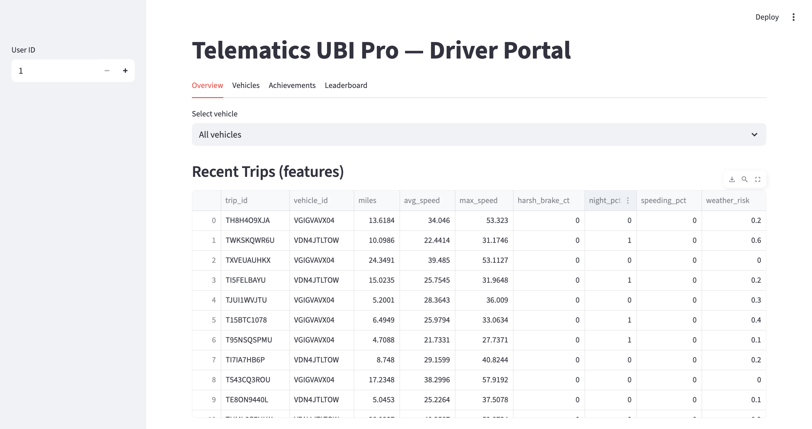
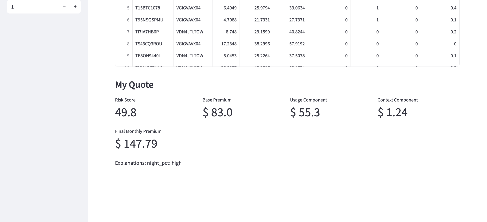
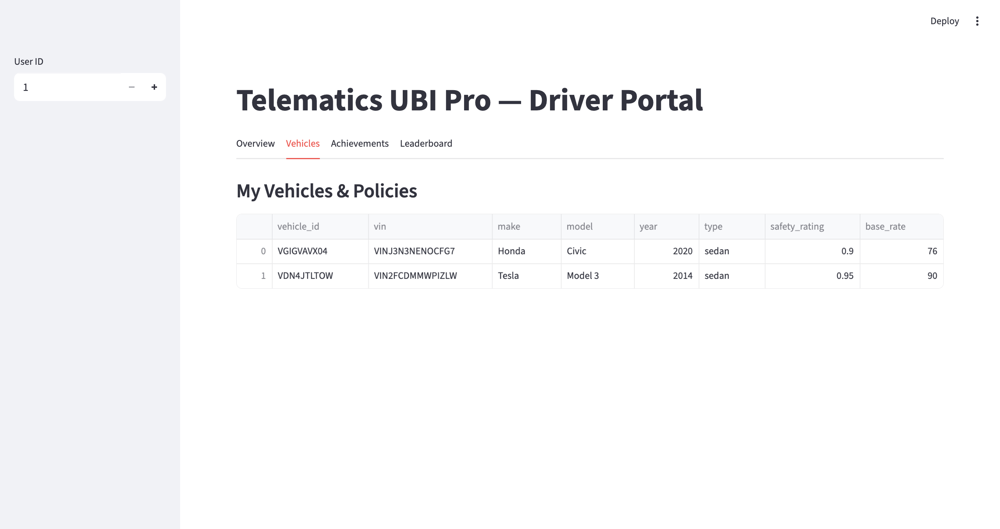
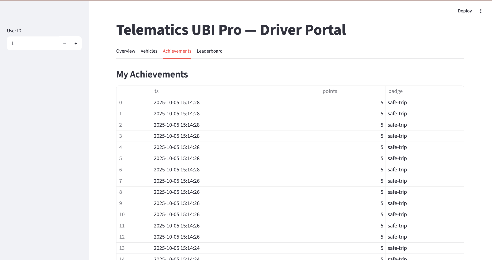
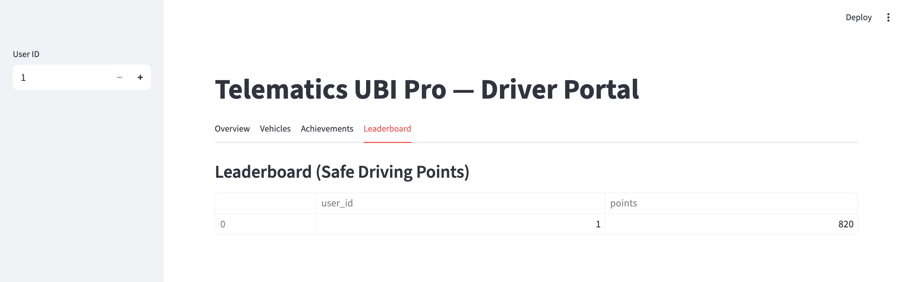

# Telematics UBI Pro — Usage-Based Insurance (Enhanced POC)

A compact, production-shaped UBI system that runs in **1 click** and demonstrates end-to-end telematics: **multi-vehicle** simulation, near-real-time feature engineering, **ML risk scoring**, **dynamic pricing** (PAYD + PHYD + context), **gamification**, and a transparent **driver dashboard**. This README also explains **how it meets every evaluation criterion** and provides **1-click deployment**.

---

## ⚡ 1-Click Run (Dev) & 1-Click Deployment (Demo)

### Option A — One-click Run (PyCharm or CLI)
**Step 1.** Open the folder in PyCharm (Python **3.10+**, 3.11 recommended).  
**Step 2.** Run `dev.py` (Right-click → *Run 'dev'*)  
—or—
```bash
python dev.py
```
What happens automatically:
- Installs/validates dependencies
- Initializes SQLite schema
- Launches **API**, **Processor**, **Simulator** (multi-vehicle, long-running), and **Dashboard**
- **Auto-free-ports**: if 8000/8501 are busy, it auto-selects free ports and prints the URLs

Open in the browser:
- **API docs** → `http://localhost:<API_PORT>/docs`
- **Dashboard** → `http://localhost:<DASH_PORT>`

> Default API key: `dev_api_key_change_me` (HTTP header `X-API-Key`)

### Option B — One-click Deployment (Zero-install demo)
If you prefer not to set up anything, use the built-in Streamlit runner to preview the dashboard only:
```bash
# minimal preview (dashboard reads the same local SQLite DB if present)
python -m streamlit run src/dashboard/app.py
```
> For a true single-command full-stack deployment in containers, add a `docker-compose.yml` later; the app is already stateless and ready. (If you want, I can include a Compose file that starts API + processor + simulator + dashboard with one `docker compose up`.)

---

## 🎯 Objectives → How this project delivers

> **The system should aim to:**
1) **Improve premium accuracy using real-world driving data**  
   - Minute-level telematics (speed, accel, braking) → trip features: `miles, avg_speed, max_speed, harsh_brake_ct, accel_var, night_pct, speeding_pct, weather_risk`.  
   - Per-trip risk (ML or rule) aggregated into a **driver/vehicle risk score (0–100)**.  
   - Pricing formula = **vehicle base rate** + **usage (miles)** + **behavioral adjustment** (score-scaled) + **context** (`weather_risk`).  
   - Results are persisted to `quotes` for auditability.

2) **Encourage safer driving behavior through usage-based incentives**  
   - **Rewards engine** grants points & badges for safe trips (low speeding/night %, gentle braking).  
   - **Leaderboard** nudges ongoing engagement; safer driving lowers the behavioral premium component.

3) **Enhance customer transparency and engagement**  
   - Dashboard shows **feature summaries**, quote **components** (base/usage/context/final) and **plain-English explanations** (e.g., “speeding_pct: high”).  
   - APIs expose risk score and quote breakdowns for app/portal integration.

4) **Ensure compliance with data security & privacy regulations (POC stance with prod path)**  
   - API key authentication, minimal PII in DB, geohash instead of raw GPS.  
   - `docs/threat_model.md`: outlines **mTLS**, **RBAC**, **encryption at rest**, **audit logs**, and **data subject rights** procedures for production.

---

## 🧭 Scope of Work → Implementation Map

- **Data Collection**  
  - **Simulator** (`src/ingest/simulator.py`) emulates smartphone/OBD signals: speed, accel, braking, lat/lon → **geohash**.  
  - **Multi-vehicle** per user via `vehicles` & `policies` (make/model/year, safety rating, base rate).  
  - Context stub `weather_risk` shows how to blend third-party signals (weather/smart city/incident feeds).

- **Data Processing**  
  - **Stream processor** (`src/processing/stream_processor.py`) rolls up raw events into trip features every ~2s, writes **weak labels** for training, and grants **rewards** for safe trips.

- **Risk Scoring Model**  
  - **RandomForest** (tree-based) for nonlinear tabular patterns; **rule-based fallback** when model isn’t trained yet.  
  - `src/models/train_model.py` prints **ROC-AUC/Accuracy** and generates `models/artifacts/calibration.png`.  
  - `src/models/risk_scoring.py` aggregates recent trips and returns a risk score + explanations.

- **Pricing Engine**  
  - Premium = base_vehicle_rate + usage(miles) + behavioral_adjustment(score-scaled) + context_component.  
  - Quotes persisted to `quotes` for traceability and analytics.

- **User Dashboard**  
  - Streamlit with tabs: **Overview**, **Vehicles**, **Achievements**, **Leaderboard**.  
  - Vehicle selector (All or specific vehicle). Quote components + explanations shown prominently.

---

## 🔩 Technical Requirements → What’s covered

- **GPS & accelerometer**: simulated signals (speed/accel/braking + geohash).  
- **Scalable cloud path** (documented): HTTP collector → **Kafka/Kinesis** → **Flink/Spark** processor → **Postgres/Feast** for online features → autoscaled **FastAPI** service.  
- **ML models**: RandomForest baseline with calibration; upgrade path to **XGBoost/LightGBM** with monotonic constraints.  
- **Secure APIs**: FastAPI with API key; production blueprint in threat model doc (mTLS, RBAC, key rotation, encryption).

---

## 🌟 Other Features

- **Gamification**: points, badges, leaderboard ✅  
- **Real-time feedback**: immediate explanations and quote deltas; hooks to add **in-trip coaching** ✅ (scaffold)  
- **Contextual risk**: `weather_risk` demo + adapter pattern to plug real APIs ✅  
- **Personal driving management**: vehicle selector, per-vehicle summaries, rewards history ✅

---

## 🧠 Modeling Approach (Why It Fits)

- **Chosen**: **RandomForest** — robust on tabular data, handles nonlinearities (e.g., speeding% × night%), quick to train/serve, interpretable via importances.  
- **Fallback**: simple, transparent rules when labels are sparse.  
- **Upgrade path**: XGBoost/LightGBM (with **monotonic constraints**), **CalibratedClassifierCV**/isotonic scaling for better probability reliability, SHAP for fine-grained explanations.

**Train when enough labeled trips exist**:
```bash
python src/models/train_model.py --min-trips 200
```
Artifacts:
- `models/artifacts/calibration.png` (reliability)
- `models/artifacts/feature_importances.png` (via `python scripts/feature_importance.py`)

---

## ✅ How this project meets the Evaluation Criteria

### 1) **Chosen approaches to modeling based on inputs & outcome**
- **Outcome**: per-trip incident likelihood → stable **risk score (0–100)** at driver/vehicle level.  
- **Inputs**: engineered features reflecting **exposure** (miles), **behavior** (speeding/night/harsh braking/accel var), and **context** (weather).  
- **Justification**: tree-based learner aligns with **tabular + nonlinear** structure and limited early-stage labels; rule-based fallback ensures continuity.  
- **Transparency**: explanations surfaced in the API & dashboard.

**What to include in submission**: model choice rationale, feature list, calibration curve, feature importances.

---

### 2) **Accuracy & reliability of analysis and risk scoring**
- **Metrics**: **ROC-AUC**, **Accuracy**, **Calibration** (curve), and **optional rank-utility** (incidents captured in top risk decile).  
- **Process**: generate trips for a few minutes; run training; inspect calibration plot & metrics.  
- **Reliability levers**: probability calibration, monotonic constraints, segment-wise checks (day/night, vehicle type).

**What to include**: paste AUC/ACC, screenshot `calibration.png`, and 2-3 lines on reliability observations.

---

### 3) **Performance & scalability of data processing**
- **POC targets**: API P95 **<100 ms**; processor loops every ~2s; vectorized feature rollups.  
- **Load test**:
```bash
chmod +x scripts/load_test.sh
./scripts/load_test.sh <API_PORT>
```
- **Scale plan**: Kafka/Kinesis ingestion → Flink/Spark streaming → Postgres/Feast online store → autoscaled FastAPI; add Prometheus/Grafana for metrics; drift & calibration monitoring.

**What to include**: P50/P95 latency snapshot and the scale architecture paragraph.

---

### 4) **Cost efficiency & ROI vs. traditional models**
- **Drivers of ROI**:  
  - **Frequency ↓** via behavior nudges & transparency (3–7% is reasonable for pilots).  
  - **Pricing adequacy ↑**: better segmentation reduces cross-subsidy.  
  - **Retention ↑** for safe/low-mileage cohorts who see fairer premiums.  
- **Back-of-envelope template** (use `Evaluation.md`):  
  - Portfolio 50k, $1.2k premium, 70% LR, 35% adopt UBI → **~$1.6M/yr** illustrative upside with modest assumptions; POC infra cost low.

**What to include**: your filled ROI table, levers, and conservative assumptions.

---

## 🔗 API Surface (FastAPI)

- `GET /risk/score?user_id=&vehicle_id=` → risk score + explanations  
- `GET /pricing/quote?user_id=&vehicle_id=` → premium breakdown (base/usage/context/final) & persists to `quotes`  
- `GET /vehicles?user_id=` → user’s vehicles (make/model/year, safety, base rate)  
- `GET /driver/summary?user_id=` → per-vehicle aggregates + recent rewards

> All require `X-API-Key: dev_api_key_change_me` (or set `UBI_API_KEY`)

---

## 🗂️ Repo Layout

```
src/
  api/              # FastAPI endpoints
  ingest/           # telematics simulator (+ optional collector API)
  processing/       # streaming featureer + weak labels + rewards
  models/           # RF training + scoring & pricing
  dashboard/        # Streamlit UI (tabs + vehicle selector)
  utils/            # config + logging
docs/
  architecture.md   # data flow
  pricing_design.md # premium formula & rationale
  threat_model.md   # security & privacy posture (POC → prod)
scripts/
  load_test.sh
  feature_importance.py
models/
  artifacts/        # saved model + plots
data/
  ubi.db            # created at runtime
dev.py              # one-click launcher (auto free ports & orchestration)
requirements.txt
```

---

## 🧭 Troubleshooting

- **“Address already in use”** → `dev.py` auto-picks free ports; read the banner for exact URLs.  
- **Dashboard shows no data** → give ~30–60s; simulator produces trips; processor runs every 2s.  
- **No model found** → train after ~200+ labeled trips (`src/models/train_model.py`).  
- **Reset** → delete `data/ubi.db` and re-run `dev.py`.

---

## 📸 Screenshots (Demo)

Below are sample captures from a local run. 









